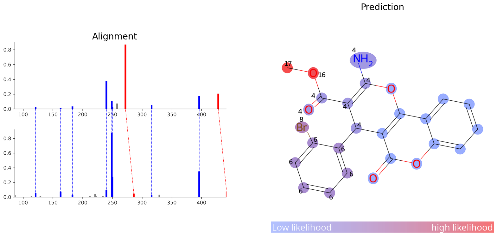

# Basics Tutorial

This guide tries to help you start working with ModiFinder.

## Create Spectrum

The Spectrum {class}`modifinder.classes.Spectrum` is a class to represent a spectrum, you can create an instance of this object by passing the USI, or from the dictionary of data, or by passing the data for the spectrum fields. check the {class}`modifinder.classes.Spectrum` for more examples and information.


```python
from modifinder import Spectrum

spectrum = Spectrum("mzspec:GNPS:BERKELEY-LAB:accession:CCMSLIB00010113829")
print(len(spectrum.mz))
```

    36


## Create Compound

The Compound {class}`modifinder.classes.Compound` is the class to represent a Compound, you can create an instance of this object by passing the USI, data in a dictionary or by passing the data for the Compound. Check the {class}`modifinder.classes.Compound` for documentation and more examples.


```python
from modifinder import Compound

compound = Compound("mzspec:GNPS:BERKELEY-LAB:accession:CCMSLIB00010113829")
print(compound)
```

    Compound(id: CCMSLIB00010113829, name: "methyl 2-amino-4-(2-bromophenyl)-5-oxo-4H-pyrano[3,2-c]chromene-3-carboxylate CollisionEnergy:102040", usi: mzspec:GNPS:GNPS-LIBRARY:accession:CCMSLIB00010113829) with 36 peaks and structure COC(=O)C1=C(N)Oc2c(c(=O)oc3ccccc23)C1c1ccccc1Br


## Basic ModiFinder Use

To use ModiFinder {class}`modifinder.classes.ModiFinder`, start by creating an instance of it. This requires at least two compounds: the target and its known analogs. You can create Modifinder class by using the USIs or using your own data.

### Create with USI

You can use ModiFinder in many scenarios but the main one is when you have a known and an unknown compound (with exactly one modification site) and you want to see the likelihood of location the modification. To pass the informations, you can use USI from GNPS. First, Lets Create the Compound objects


```python
from modifinder import ModiFinder, Compound
from matplotlib import pyplot as plt

c1 = "mzspec:GNPS:BERKELEY-LAB:accession:CCMSLIB00010113829"
c2 = "mzspec:GNPS:BERKELEY-LAB:accession:CCMSLIB00010125628"
helpers_array = ['mzspec:GNPS:BERKELEY-LAB:accession:CCMSLIB00010114304']
args = {
    'mz_tolerance': 0.01,
    'ppm_tolerance': 40,
    'ratio_to_base_peak': 0.01,
    'normalize_peaks': True
}
known_compound = Compound(c1, id=c1, **args)
modified_compound = Compound(c2, id=c2, **args)
helpers_compounds = [Compound(h, id=h, **args) for h in helpers_array]
```

Next, we can define ModiFinder object by passing the Known Compound, ModiFied analog and the helpers to that


```python
mf = ModiFinder(known_compound, modified_compound, helpers=helpers_array, **args)
probs = mf.generate_probabilities()

print("predicted probabilities are: \n", probs)
```

    predicted probabilities are: 
     [0.16592098 0.15792845 0.03942338 0.04082704 0.03942338 0.03942338
     0.03942338 0.         0.         0.         0.         0.
     0.         0.         0.         0.         0.         0.
     0.         0.03942338 0.06012586 0.06012586 0.06012586 0.06012586
     0.06012586 0.06012586 0.07745147]


ModiFinder also comes with a lot of visualizing tools, let's visualize the alignment and the prediction


```python
img_alignment = mf.draw_alignment(known_compound.id, modified_compound.id)

img_prediction = mf.draw_prediction(probs, known_compound.id, show_legend=True, show_labels=True, shrink_labels=True, size=(1000, 1000), annotation_scale = 0.6)

fig, ax = plt.subplots(1, 2, figsize=(20, 10))
ax[0].imshow(img_alignment)
ax[0].set_title('Alignment', fontsize=20)
ax[1].imshow(img_prediction)
ax[1].set_title('Prediction', fontsize=20)

for a in ax:
    a.axis('off')

plt.show()
```


    

    


### Create with your data
You can also create your compounds by passing a dictionary


```python
from modifinder.utilities import visualizer as mf_vis

known_compound_data = {
    "id": "CCMSLIB00010113829",
    "Compound_Name" : "\"methyl 2-amino-4-(2-bromophenyl)-5-oxo-4H-pyrano[3,2-c]chromene-3-carboxylate CollisionEnergy:102040\"" ,
    "Ion_Source" : "LC-ESI",
    "Compound_Source" : "Commercial" ,
    "Instrument" : "Orbitrap" ,
    "PI" : "Trent Northen" ,
    "Data_Collector" : "JGI" ,
    "Adduct" : "M+H" ,
    "Precursor_MZ" : "428.013" ,
    "Charge" : "1" ,
    "Smiles" : "COC(=O)C1=C(N)Oc2c(c(=O)oc3ccccc23)C1c1ccccc1Br",
    "Ion_Mode" : "Positive",
    "ms_level" : "2",
    "peaks" : [[60.998299,2942.000000],[82.425079,2944.000000],[100.039070,16193.000000],[118.427040,3043.000000],[121.018578,3089.000000],[121.028198,88610.000000],[152.897842,2874.000000],[163.038513,46777.000000],[168.043304,5484.000000],[182.943802,109108.000000],[187.409912,3183.000000],[196.038361,3732.000000],[202.218048,2971.000000],[207.029480,3299.000000],[207.976593,4085.000000],[212.033859,24431.000000],[221.989578,4474.000000],[233.956146,5784.000000],[240.028702,1177115.000000],[249.054092,340590.000000],[250.062012,91262.000000],[258.039154,229840.000000],[262.062988,16671.000000],[272.054871,2691841.000000],[275.965454,19609.000000],[280.037537,3552.000000],[281.055145,18616.000000],[288.063934,4550.000000],[289.070587,5006.000000],[299.056152,6172.000000],[316.059662,162469.000000],[317.067596,19549.000000],[328.979919,22114.000000],[377.973846,3657.000000],[395.985809,537614.000000],[428.011810,641369.000000]]
}

modified_compound_data = {
    "id" : "CCMSLIB00010125628",
    "Compound_Name" : "\"ethyl 2-amino-4-(2-bromophenyl)-5-oxo-4H-pyrano[3,2-c]chromene-3-carboxylate CollisionEnergy:205060\"" ,
    "Ion_Source" : "LC-ESI" ,
    "Compound_Source" : "Commercial" ,
    "Instrument" : "Orbitrap" ,
    "PI" : "Trent Northen" ,
    "Data_Collector" : "JGI" ,
    "Adduct" : "M+H" ,
    "Precursor_MZ" : "442.028" ,
    "Charge" : "1" ,
    "Smiles" : "CCOC(=O)C1=C(N)Oc2c(c(=O)oc3ccccc23)C1c1ccccc1Br",
    "ms_level" : "2" ,
    "peaks" : [[66.744087,3088.000000],[68.013557,5761.000000],[68.997673,4342.000000],[84.944817,2668.000000],[86.023949,39517.000000],[87.111252,2685.000000],[88.211983,2617.000000],[91.054718,2792.000000],[96.069580,2500.000000],[106.532509,2811.000000],[114.054657,20689.000000],[121.028481,81112.000000],[129.057541,23604.000000],[140.050171,3201.000000],[142.849548,3238.000000],[155.036545,4860.000000],[163.039078,115792.000000],[168.044922,10549.000000],[182.943878,49352.000000],[191.034134,5956.000000],[194.072769,3414.000000],[205.958740,3058.000000],[207.028503,4013.000000],[207.975830,12770.000000],[212.034348,15917.000000],[214.049545,6682.000000],[221.059967,62232.000000],[222.067261,17084.000000],[233.955292,19126.000000],[234.939468,3125.000000],[240.029068,141213.000000],[249.054565,1321279.000000],[250.062378,417286.000000],[252.948257,4031.000000],[258.038971,6431.000000],[275.964935,6739.000000],[279.358429,2923.000000],[280.038574,5165.000000],[286.036102,2804.000000],[286.070740,71269.000000],[288.065002,4675.000000],[298.048431,3912.000000],[316.059784,39353.000000],[328.980804,50655.000000],[347.603516,3589.000000],[395.986420,526724.000000],[442.028503,115024.000000],[508.895294,3412.000000]]
}
    
known_compound = Compound(known_compound_data, **args)
modified_compound = Compound(modified_compound_data, **args)
mf = ModiFinder(known_compound, modified_compound, helpers=helpers_array, **args)
probs = mf.generate_probabilities()

img_prediction = mf.draw_prediction(probs, known_compound.id, show_legend=False, show_labels=True, shrink_labels=True, size=(1000, 1000), annotation_scale = 0.6)

true_modification = mf_vis.draw_modifications(known_compound.structure, modified_compound.structure, show_legend = False, 
                                              show_labels=True, shrink_labels=True, modification_only=True)


fig, ax = plt.subplots(1, 2, figsize=(10, 5))
ax[0].imshow(img_prediction)
ax[0].set_title("Prediction")
ax[1].imshow(true_modification)
ax[1].set_title("True Modification")

for a in ax:
    a.axis('off')
plt.show()
```


    

    


## Evaluation of the prediction

To assess the accuracy of predictions, several evaluation metrics are available. First, create an instance of the `modifinder.engines.evaluation.BasicEvaluationEngine` class. Once instantiated, you can input the actual structure of the target compound, its analog, and the prediction into this engine to obtain the evaluation score. 


```python
from modifinder import BasicEvaluationEngine

eval_engine = BasicEvaluationEngine()
target_structure = modified_compound.structure
analog_structure = known_compound.structure
eval_score = eval_engine.evaluate_single(analog_structure, target_structure, probs)
print("Evaluation score is: ", round(eval_score, 3))
```

    Evaluation score is:  0.514


If you want to use an evaluation method other than the default, you can just pass that during initialization or when calling the evaluate_single function


```python
eval_engine = BasicEvaluationEngine(default_method="is_max")
target_structure = modified_compound.structure
analog_structure = known_compound.structure
is_max_eval_score = eval_engine.evaluate_single(analog_structure, target_structure, probs)
average_distance_eval_score = eval_engine.evaluate_single(analog_structure, target_structure, probs, evaluation_method="average_distance")
print("IsMax Evaluation score is: ", round(is_max_eval_score, 3), "Average Distance Evaluation score is: ", round(average_distance_eval_score, 3))
```

    IsMax Evaluation score is:  1.0 Average Distance Evaluation score is:  0.514


To learn how you can customize different parts of this process, check the Customization documents
