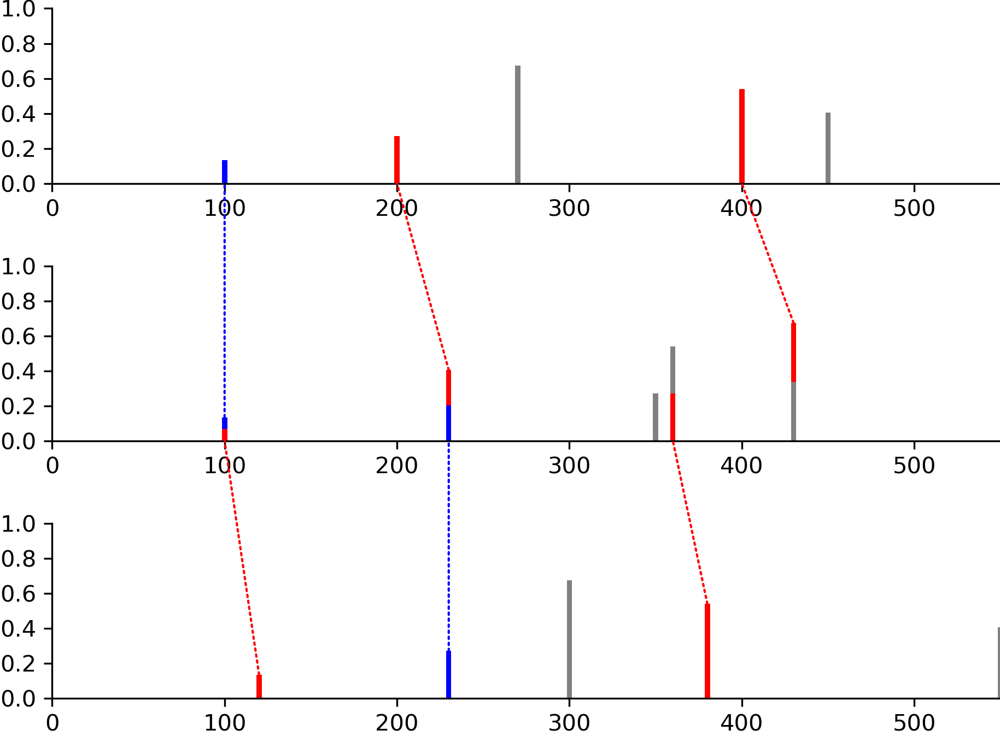
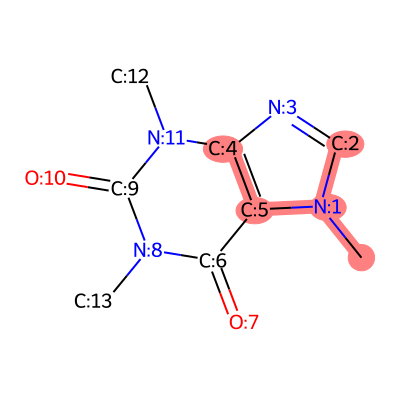

# Visualization and Drawing

ModiFinder includes powerful visualization tools built on RDKit and matplotlib for creating publication-quality figures.

```{note}
**Complete API documentation with all examples and images:**  
See the [Visualizer API Reference](../modifinder/drawing.rst) for detailed examples with visual outputs.
```

## Overview

The {mod}`modifinder.utilities.visualizer` module provides:

- {func}`~modifinder.utilities.visualizer.draw_molecule` - Draw molecular structures (from SMILES, InChI, USI, or RDKit mol)
- {func}`~modifinder.utilities.visualizer.draw_spectrum` - Draw mass spectra with custom colors
- {func}`~modifinder.utilities.visualizer.draw_modifications` - Compare two structures and highlight differences
- {func}`~modifinder.utilities.visualizer.draw_alignment` - Align and compare multiple spectra
- {func}`~modifinder.utilities.visualizer.draw_molecule_heatmap` - Visualize atom-level probabilities
- {func}`~modifinder.utilities.visualizer.draw_frag_of_molecule` - Highlight molecular fragments

## Quick Examples

### Drawing a Molecule

Draw from SMILES, InChI, GNPS identifiers, or RDKit molecules:

```python
from modifinder.utilities import visualizer as viz
import matplotlib.pyplot as plt

# Simple molecule
img = viz.draw_molecule('CN1C=NC2=C1C(=O)N(C(=O)N2C)C', label="Caffeine")
plt.imshow(img)
plt.axis('off')
plt.show()
```


**With atom highlighting:**

```python
from rdkit import Chem

mol = Chem.MolFromSmiles('CN1C=NC2=C1C(=O)N(C(=O)N2C)C')
# Add atom indices for visualization
for atom in mol.GetAtoms():
    atom.SetAtomMapNum(atom.GetIdx())

img = viz.draw_molecule(mol, highlightAtoms={1, 3, 11, 8}, label="Caffeine")
```


See {func}`~modifinder.utilities.visualizer.draw_molecule` for all options.

### Drawing a Spectrum

Color peaks by type or matched status:

```python
# Create spectrum data
mz = [100, 200, 270, 400, 450]
intensity = [0.1, 0.2, 0.5, 0.4, 0.3]

# Define colors for specific peaks
colors = {
    0: 'red',           # Single color
    1: ['blue', 'green'],  # Split color (top/bottom)
    3: '#FFA500',       # Hex code
    4: (0.9, 0.9, 0.2)  # RGB tuple
}

img = viz.draw_spectrum(
    list(zip(mz, intensity)),
    show_x_label=True,
    show_y_label=True,
    colors=colors
)
```


See {func}`~modifinder.utilities.visualizer.draw_spectrum` for all options.

### Comparing Structures

Highlight what changed between two molecules:

```python
smiles1 = 'N[C@@H](CCC(=O)N[C@@H](CS)C(=O)NCC(O)=O)C(O)=O'
smiles2 = 'CCCCCCSCC(CNCC(=O)O)NC(=O)CCC(C(=O)O)N'

img = viz.draw_modifications(smiles1, smiles2, show_legend=True)
```


- **Blue**: Common atoms/bonds
- **Green**: Added in molecule 2  
- **Red**: Removed from molecule 1

See {func}`~modifinder.utilities.visualizer.draw_modifications` for options like `modification_only=True`.

### Molecular Heatmaps

Visualize atom-level probabilities or scores:

```python
from rdkit import Chem
import numpy as np

mol = Chem.MolFromSmiles('CN1C=NC2=C1C(=O)N(C(=O)N2C)C')
scores = np.random.rand(mol.GetNumAtoms())  # Your probability data

img = viz.draw_molecule_heatmap(
    mol,
    scores,
    show_labels=True,
    show_legend=True,
    label="Caffeine"
)
```


Perfect for ModiFinder predictions! See {func}`~modifinder.utilities.visualizer.draw_molecule_heatmap`.

### Spectral Alignment

Compare multiple spectra with matched peaks:

```python
peaks1 = [(100, 0.1), (200, 0.2), (270, 0.5), (400, 0.4), (450, 0.3)]
peaks2 = [(100, 0.1), (230, 0.3), (350, 0.2), (360, 0.4), (430, 0.5)]
peaks3 = [(120, 0.1), (230, 0.2), (300, 0.5), (380, 0.4), (550, 0.3)]

# Define peak matches between spectra
matches = [
    [(0, 0), (1, 1), (3, 4)],  # peaks1 to peaks2
    [(0, 0), (1, 1), (3, 3)]   # peaks2 to peaks3
]

img = viz.draw_alignment(
    [peaks1, peaks2, peaks3],
    matches=matches,
    normalize_peaks=True
)
```



Dotted lines show matched peaks. See {func}`~modifinder.utilities.visualizer.draw_alignment`.

### Highlighting Fragments

Show specific parts of a molecule:

```python
from rdkit import Chem

mol = Chem.MolFromSmiles('CN1C=NC2=C1C(=O)N(C(=O)N2C)C')
# Add atom indices
for atom in mol.GetAtoms():
    atom.SetAtomMapNum(atom.GetIdx())

# Binary representation: highlight atoms 0, 1, 2, 4, 5
fragment = int("110111", 2)  # Binary to decimal
img = viz.draw_frag_of_molecule(mol, fragment)
```



See {func}`~modifinder.utilities.visualizer.draw_frag_of_molecule`.

## Common Workflows

### Creating Multi-Panel Figures

```python
fig, axs = plt.subplots(1, 3, figsize=(15, 5))

img1 = viz.draw_molecule(smiles1, label="Original")
img2 = viz.draw_molecule(smiles2, label="Modified")
img3 = viz.draw_modifications(smiles1, smiles2, label="Differences")

axs[0].imshow(img1)
axs[1].imshow(img2)
axs[2].imshow(img3)

for ax in axs:
    ax.axis('off')

plt.tight_layout()
plt.savefig('comparison.png', dpi=300)
```

### Output Formats

All drawing functions support PNG and SVG outputs:

```python
# PNG (default) - returns numpy array
img_png = viz.draw_molecule(mol, output_type='png')

# SVG - returns SVG string
svg = viz.draw_molecule(mol, output_type='svg')
with open('molecule.svg', 'w') as f:
    f.write(svg)
```

## Tips for Publication-Quality Figures

- **DPI**: Use `dpi=300` for high-resolution PNG images
- **Size**: Set `size=(width, height)` in inches for figure dimensions
- **Font**: Adjust `font_size` parameter for labels and text
- **Colors**: Use hex codes or RGB tuples for precise color control
- **Labels**: Add molecule labels with `label="Name"` parameter

## More Examples

All functions have detailed examples with images in the API documentation:

- [Visualizer Module API](../modifinder/drawing.rst) - Complete reference with all examples and images

## Next Steps

- [ModiFinder Basics](basics.rst) - Run modification site predictions
- [API Reference](../modifinder/index.rst) - Complete function documentation
